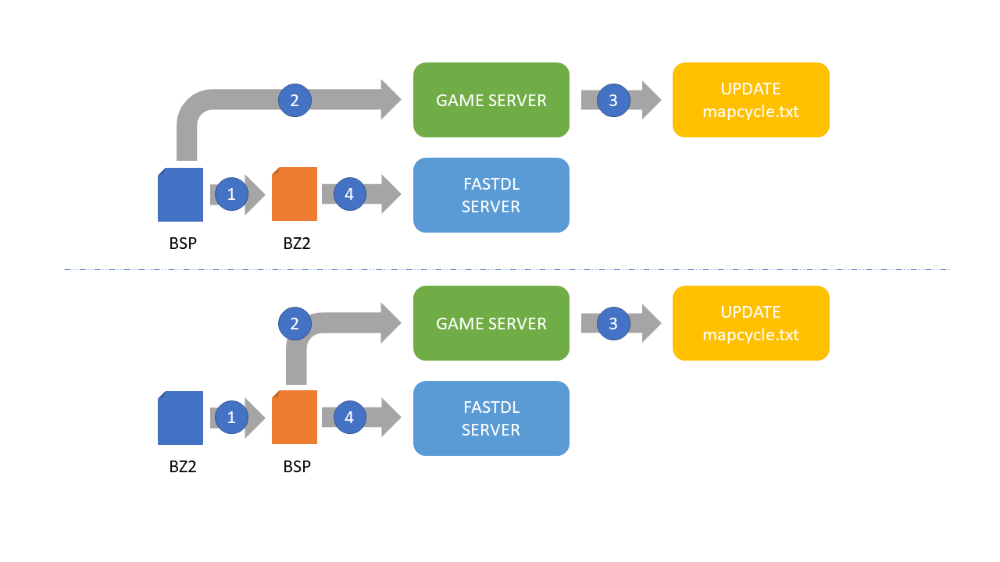
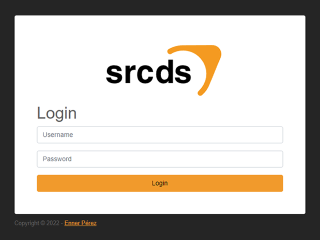
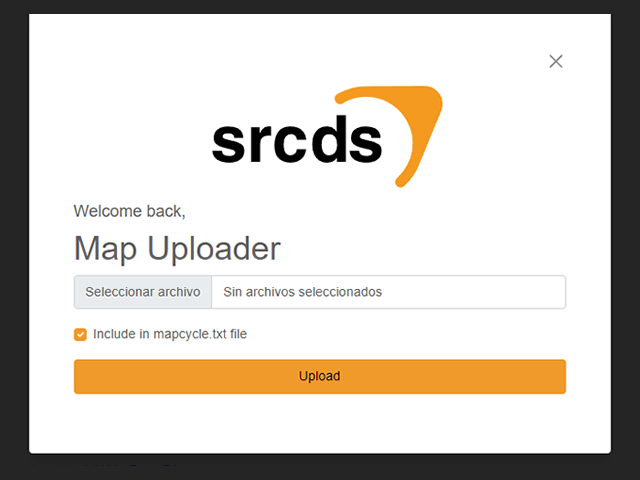

# SRCDS BSP Uploader

Simple administrative Web UI for upload maps for SRCDS based games.

## Features
- [x] Compress BSP files
- [x] Uncompress BZ2 files
- [x] Include in map rotation
- [x] Upload audit
- [x] Override control
- [ ] Roles & permissions
- [ ] User administration
- [ ] Map naming control
- [ ] Checksum files validation

## How this works

1. BSP file get compressed in server into a BZ2 file format
1. BSP file get uncompressed in server into a BSP file format
2. BSP file get uploaded to game server map folder
3. BSP Map Name get included in `mapcycle.txt` file
4. BZ2 file get uploaded to fast download server

## Configuration

- Set all variables in a new `.env` file using `.env.example` as guide
- After installation use `admin` user and any password, this will be saved for next logins
- New users must be added without password in database for same initialization

## Screenshots

### Login Screen

### Uploader Screen

